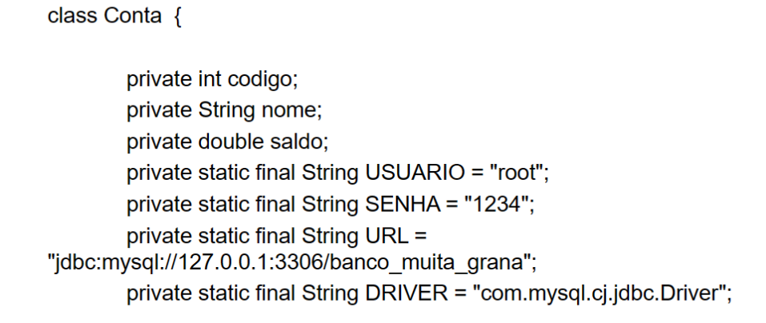
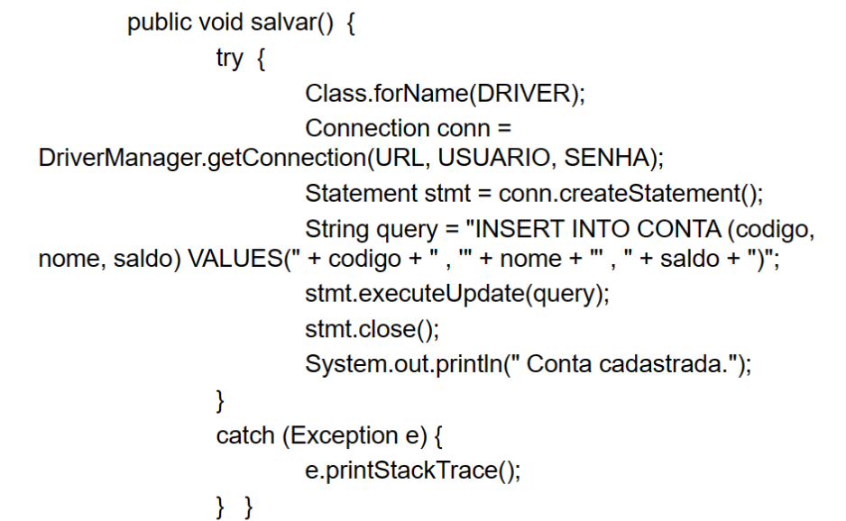

# Aplicando Solid com Java

# Contextualização
A imagem a seguir tem um exemplo de uma classe que viola um dos princípios SOLID vistos em sala.

Que princípio é esse?
- Responsabilidade única

# Desafio
Refatore essa classe, para que ela não viole nenhum princípio SOLID mais.
